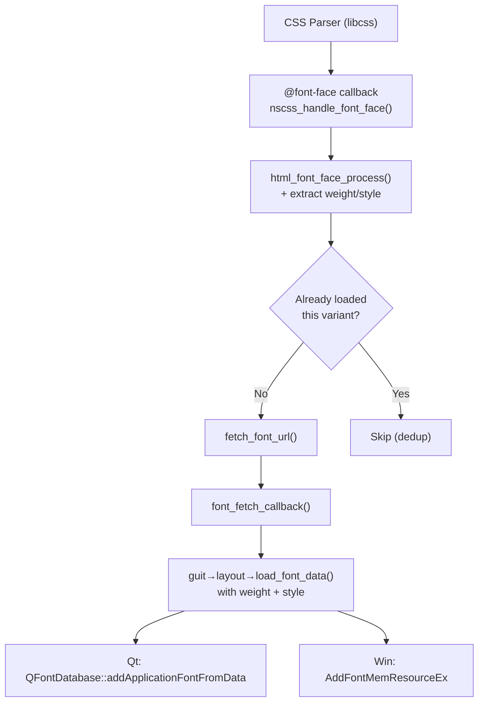

# Font Variant Loading Implementation Plan

## Problem Statement

Currently, wisp only loads **one font variant per family** (typically the Regular variant), causing poor bold/italic rendering. When CSS requests `font-weight: bold`, Qt synthesizes bold by thickening the Regular font, resulting in fuzzy edges.

## Root Cause Analysis

### How @font-face processing works

Each `@font-face` rule in CSS triggers a separate `nscss_handle_font_face()` callback in `css.c`, which calls `html_font_face_process()`. A site like Google Fonts will have multiple rules per family:

```css
@font-face { font-family: 'Source Sans Pro'; font-weight: 400; src: url(Regular.otf); }
@font-face { font-family: 'Source Sans Pro'; font-weight: 700; src: url(Bold.otf); }
@font-face { font-family: 'Source Sans Pro'; font-style: italic; src: url(Italic.otf); }
```

Each of these triggers a separate call to `html_font_face_process()`.

### The bug: family-only deduplication

In `html_font_face_process()` (line 257):

```c
/* Check if already loaded */
if (html_font_face_is_available(family_name)) {
    NSLOG(wisp, DEBUG, "Font '%s' already available", family_name);
    return NSERROR_OK;
}
```

`html_font_face_is_available()` checks by **family name only**. Once "Source Sans Pro" Regular is loaded, all subsequent calls for Bold, Italic, etc. immediately return because the family name matches.

> [!NOTE]
> The `break` after the first successful fetch (line 314) is **correct** — it iterates
> over alternative sources for the *same* `@font-face` rule (e.g., try WOFF, then OTF
> fallback). It does **not** prevent cross-variant loading.

### Logs confirm

```
nscss_handle_font_face: Parsed @font-face for family 'Source Sans Pro'   ← 400 Regular
fetch_font_url: Fetching font 'Source Sans Pro' from ...Regular.otf
font_fetch_callback: Font 'Source Sans Pro' downloaded (229588 bytes)
nscss_handle_font_face: Parsed @font-face for family 'Source Sans Pro'   ← 700 Bold
  → "Font 'Source Sans Pro' already available" ← SKIPPED!
```

### Secondary issue: no variant metadata passed to frontend

Even after fixing the deduplication, the `load_font_data` callback currently has no way to communicate weight/style to the frontend:

```c
// Current signature — no variant info
nserror (*load_font_data)(const char *family_name, const uint8_t *data, size_t size);
```

The frontend needs this metadata for correct font selection at render time.

## Available libcss API

libcss already provides everything we need — no libcss changes required:

| Function | Returns | Notes |
|----------|---------|-------|
| `css_font_face_font_weight()` | `uint8_t` (`css_font_weight_e`) | Enum: `NORMAL=0x1`, `BOLD=0x2`, `100=0x5` … `900=0xd` |
| `css_font_face_font_style()` | `uint8_t` (`css_font_style_e`) | Enum: `NORMAL=0x1`, `ITALIC=0x2`, `OBLIQUE=0x3` |
| `css_font_face_get_font_family()` | `lwc_string**` | Family name |

> [!IMPORTANT]
> `font-stretch` is **not** stored in the libcss `css_font_face` struct (only `bits[1]`
> encoding `__wwwwss` for weight|style). Adding stretch requires libcss modifications
> and is out of scope for this plan.

## Architecture



## Implementation Plan

### Phase 1: Core — Fix dedup + carry variant info

#### 1.1 Add weight/style to `font_download` struct

[font_face.c](file:///mnt/netac/proj/wisp/src/content/handlers/html/font_face.c)

```c
struct font_download {
    char *family_name;
    llcache_handle *handle;
    bool in_use;
    uint8_t weight;   /* css_font_weight_e from @font-face descriptor */
    uint8_t style;    /* css_font_style_e from @font-face descriptor */
};
```

#### 1.2 Make dedup variant-aware

Replace the `loaded_font` tracking to include weight/style:

```c
struct loaded_font {
    char *family_name;
    uint8_t weight;
    uint8_t style;
    struct loaded_font *next;
};
```

Update `html_font_face_is_available()` → `is_variant_loaded()`:

```c
static bool is_variant_loaded(const char *family_name, uint8_t weight, uint8_t style)
{
    for (struct loaded_font *e = loaded_fonts; e; e = e->next) {
        if (strcasecmp(e->family_name, family_name) == 0 &&
            e->weight == weight && e->style == style)
            return true;
    }
    return false;
}
```

Keep `html_font_face_is_available()` as a public API that checks for **any** variant of a family (for the existing callers).

Add `is_variant_pending()` to also catch duplicate in-flight downloads:

```c
static bool is_variant_pending(const char *family_name, uint8_t weight, uint8_t style)
{
    for (int i = 0; i < MAX_FONT_DOWNLOADS; i++) {
        if (font_downloads[i].in_use &&
            strcasecmp(font_downloads[i].family_name, family_name) == 0 &&
            font_downloads[i].weight == weight &&
            font_downloads[i].style == style)
            return true;
    }
    return false;
}
```

This gives three layers of dedup:
1. **Variant-aware loaded check** — won't re-fetch already registered fonts
2. **Pending download check** — won't start duplicate in-flight downloads
3. **llcache URL dedup** — underlying cache won't re-download the same URL (safety net)

#### 1.3 Extract variant descriptors in `html_font_face_process()`

```c
nserror html_font_face_process(const css_font_face *font_face, const char *base_url)
{
    /* ... existing family_name extraction ... */

    /* Get variant descriptors from libcss */
    uint8_t weight = css_font_face_font_weight(font_face);
    uint8_t style  = css_font_face_font_style(font_face);

    /* Check if this specific variant is already loaded or downloading */
    if (is_variant_loaded(family_name, weight, style) ||
        is_variant_pending(family_name, weight, style)) {
        NSLOG(wisp, DEBUG, "Font '%s' variant (w=%d s=%d) already loaded/pending",
              family_name, weight, style);
        return NSERROR_OK;
    }

    /* ... existing source iteration ... */

    /* Pass variant info to fetch_font_url */
    err = fetch_font_url(family_name, font_url, base, weight, style);
    /* ... */
}
```

#### 1.4 Thread variant info through fetch → callback

Update `fetch_font_url()` to accept and store weight/style:

```c
static nserror fetch_font_url(const char *family_name, nsurl *font_url,
                              nsurl *base_url, uint8_t weight, uint8_t style)
{
    struct font_download *dl = find_free_slot();
    /* ... */
    dl->weight = weight;
    dl->style  = style;
    /* ... existing fetch logic ... */
}
```

Update `font_fetch_callback()` to pass variant info to frontend:

```c
case LLCACHE_EVENT_DONE: {
    /* ... */
    if (guit && guit->layout && guit->layout->load_font_data) {
        err = guit->layout->load_font_data(
            dl->family_name, data, size, dl->weight, dl->style);
    }
    if (err == NSERROR_OK) {
        mark_font_loaded(dl->family_name, dl->weight, dl->style);
    }
    /* ... */
}
```

---

### Phase 2: Interface change

#### 2.1 Update `gui_layout_table` in [layout.h](file:///mnt/netac/proj/wisp/include/wisp/layout.h)

```c
/**
 * Load font data into the system font database.
 *
 * Called when a web font (@font-face) has been downloaded.
 *
 * \param[in] family_name CSS font-family name
 * \param[in] data        Raw font file data (TrueType/OpenType/WOFF)
 * \param[in] size        Size of font data in bytes
 * \param[in] weight      css_font_weight_e descriptor from @font-face
 * \param[in] style       css_font_style_e descriptor from @font-face
 * \return NSERROR_OK on success, or appropriate error code
 */
nserror (*load_font_data)(const char *family_name, const uint8_t *data,
                          size_t size, uint8_t weight, uint8_t style);
```

---

### Phase 3: Qt frontend — variant-aware font selection

#### 3.1 Update `nsqt_load_font_data` in [layout.cpp](file:///mnt/netac/proj/wisp/frontends/qt/layout.cpp)

Accept the new parameters. Optionally store variant-to-Qt-family mapping for render-time lookup:

```cpp
static nserror nsqt_load_font_data(const char *family_name,
    const uint8_t *data, size_t size, uint8_t weight, uint8_t style)
{
    /* Existing QFontDatabase registration — unchanged */
    QByteArray fontData(reinterpret_cast<const char*>(data), size);
    int fontId = QFontDatabase::addApplicationFontFromData(fontData);
    if (fontId == -1) return NSERROR_INVALID;

    QStringList families = QFontDatabase::applicationFontFamilies(fontId);
    if (!families.isEmpty()) {
        QString cssName = QString::fromUtf8(family_name);
        QString qtName  = families.first();

        QFont::insertSubstitution(cssName, qtName);
        NSLOG(wisp, INFO, "Loaded font '%s' w=%d s=%d -> Qt '%s'",
              family_name, weight, style, qtName.toUtf8().constData());
    }

    /* ... existing FOUT repaint scheduling ... */
    return NSERROR_OK;
}
```

> [!NOTE]
> In most cases, `QFontDatabase::addApplicationFontFromData` already registers the
> font with the correct weight/style metadata embedded in the font file itself. Qt's
> font matching engine will then select the right variant automatically. The weight/style
> parameters are primarily useful for logging and for cases where the embedded metadata
> doesn't match the CSS descriptor.

---

### Phase 4: Windows frontend — signature update

#### 4.1 Update `html_font_face_load_data` in [font.c](file:///mnt/netac/proj/wisp/frontends/windows/font.c)

Minimal change — just accept the new parameters. Windows' `AddFontMemResourceEx` and `CreateFont` handle variant matching internally:

```c
nserror html_font_face_load_data(const char *family_name,
    const uint8_t *data, size_t size, uint8_t weight, uint8_t style)
{
    /* Existing implementation — unchanged, just log the variant */
    NSLOG(wisp, INFO, "Loading Windows font '%s' weight=%d style=%d",
          family_name, weight, style);
    /* ... existing AddFontMemResourceEx code ... */
}
```

---

## Files to Modify

### Core (shared across all frontends)

| File | Changes |
|------|---------|
| [font_face.c](file:///mnt/netac/proj/wisp/src/content/handlers/html/font_face.c) | Add weight/style to `font_download` and `loaded_font`, fix variant-aware dedup, extract descriptors, pass through callback |
| [font_face.h](file:///mnt/netac/proj/wisp/src/content/handlers/html/font_face.h) | No public API changes needed (keep `html_font_face_is_available` as family-level check) |
| [layout.h](file:///mnt/netac/proj/wisp/include/wisp/layout.h) | Add `weight` and `style` params to `load_font_data` |

### Frontends (platform-specific)

| File | Changes |
|------|---------|
| [layout.cpp](file:///mnt/netac/proj/wisp/frontends/qt/layout.cpp) | Update `nsqt_load_font_data` signature + logging |
| [font.c](file:///mnt/netac/proj/wisp/frontends/windows/font.c) | Update `html_font_face_load_data` signature + logging |

## Verification Plan

### Build verification
```bash
cd /mnt/netac/proj/wisp/build
cmake -DCMAKE_BUILD_TYPE=Debug -GNinja -DNEOSURF_ENABLE_PERF_TRACE=OFF -DNEOSURF_ENABLE_TESTS=ON ..
ninja
```

### Log verification

Test with a page that uses multiple @font-face variants (e.g., Google Fonts):

```bash
./frontends/qt/wisp-qt -split-logs https://fonts.google.com
```

Check `neosurf-logs/ns-deepdebug.txt` for:
1. Multiple "Fetching font" lines for the same family with different weights
2. Multiple "Loaded font" lines reaching the frontend
3. No "already available" lines for Bold/Italic variants

### Visual verification

Load a page with bold text using web fonts and visually compare rendered bold text quality before/after the fix. Bold text should appear sharp rather than artificially thickened.

> [!IMPORTANT]
> User guidance needed: please suggest a specific test page or HTML file that uses
> multiple @font-face variants for visual comparison testing.

## Risks and Considerations

1. **Memory**: Loading multiple variants increases memory usage (one font file per variant). Most sites load 2–4 variants; impact is moderate.
2. **Backward compatibility**: The `load_font_data` signature change is a breaking API change — all frontends must be updated simultaneously.
3. **Weight enum mapping**: Frontends need to understand `css_font_weight_e` enums (not raw 100–900 values). A helper function may be useful.
4. **font-stretch**: Not supported by libcss's `css_font_face` — out of scope. Can be added later if libcss is extended.

## Implementation Order

1. Core changes in `font_face.c` (dedup fix + variant threading)
2. Interface change in `layout.h`
3. Qt frontend update
4. Windows frontend update
5. Build + test
