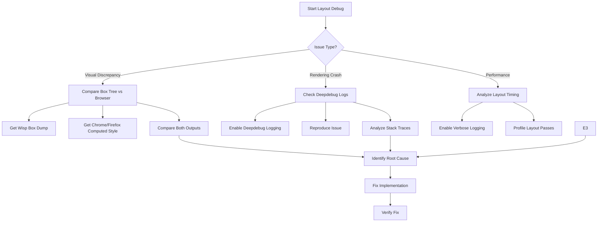

# Layout Debugging Process for Wisp Browser

## Overview

This document outlines a systematic approach to debugging layout issues in the Wisp browser rendering engine.

## Debugging Tools Available in Wisp

### 1. Logging System

Wisp has a multi-level logging system with split log files:

| Log File | Purpose |
|----------|---------|
| `wisp-logs/ns-deepdebug.txt` | Deep debug information |
| `wisp-logs/ns-debug.txt` | General debug messages |
| `wisp-logs/ns-verbose.txt` | Verbose output |
| `wisp-logs/ns-info.txt` | Informational messages |
| `wisp-logs/ns-warning.txt` | Warnings |
| `wisp-logs/ns-error.txt` | Errors |
| `wisp-logs/ns-critical.txt` | Critical issues |

### 2. Box Tree Dump

The [`box_dump()`](src/content/handlers/html/box_inspect.c:638) function outputs the complete box tree structure with:

- Box coordinates (x, y, width, height)
- Min/max width values
- Margin values for all sides
- Box types (BLOCK, INLINE, TABLE, etc.)
- Descendant information
- Style information (when enabled)

**Usage locations:**
- [`ALWAYS_DUMP_BOX`](src/content/handlers/html/html.c:238) - dumps on every render
- Error assertions in [`layout.c`](src/content/handlers/html/layout.c:425) - dumps on layout errors

### 3. DOM Tree Access

The [`html_get_box_tree()`](src/content/handlers/html/html.c:2116) function provides access to the box tree for programmatic inspection.

---

## Proposed Debugging Workflow

---

## Information to Request from Chrome/Firefox

To compare Wisp's rendering against standard browsers, please provide the following:

### 1. For Visual Layout Issues

**Screenshot comparison:**
- Screenshot from Wisp showing the issue
- Screenshot from Chrome/Firefox showing expected rendering

**HTML/CSS minimal reproduction:**
- The minimal HTML file that reproduces the issue
- Any inline CSS or external stylesheet causing problems

### 2. For Box Model Issues

**Chrome DevTools - Computed Panel:**
- Open DevTools (F12)
- Select the problematic element
- Go to **Computed** tab
- Screenshot or export the box model showing:
  - margin (top, right, bottom, left)
  - border
  - padding
  - content dimensions

**Chrome DevTools - Elements Panel:**
- Right-click element → Copy → Copy outerHTML
- Screenshot of the **Styles** panel showing applied CSS

### 3. For Complex Layouts (Flexbox/Grid)

**Additional Chrome DevTools information:**
- **Flexbox** panel: Show flex container properties
- **Grid** panel: Show grid template areas and tracks
- **Layout** tab: Show overlay highlights of grid/flex items

### 4. For Debug Logs

**Enable Chrome's verbose logging (for comparison):**
- DevTools → Settings → Console → "Preserve log"
- Network tab → "Preserve log"
- Console → Filter by category (Errors, Warnings)

---

## Step-by-Step Debugging Process

### Step 1: Isolate the Issue

1. Create minimal HTML test case
2. Identify which layout system is affected:
   - Block layout (default)
   - Flexbox ([`layout_flex.c`](src/content/handlers/html/layout_flex.c))
   - Grid ([`layout_grid.c`](src/content/handlers/html/layout_grid.c))
   - Tables ([`table.c`](src/content/handlers/html/table.c))

### Step 2: Gather Wisp Internal Data

1. **Enable box tree dumping** - modify code to enable `ALWAYS_DUMP_BOX` or call `box_dump()` after layout
2. **Enable deepdebug logs** - check logging configuration in [`log.c`](src/utils/log.c:511)
3. **Capture redraw logs** - check [`redraw.c`](src/content/handlers/html/redraw.c) for debug output

### Step 3: Gather Browser Reference Data

Follow the Chrome/Firefox DevTools instructions above to get the expected rendering.

### Step 4: Compare and Analyze

Compare these key properties:

| Property | What to Check |
|----------|---------------|
| Box dimensions | width, height match between Wisp and browser |
| Box position | x, y coordinates |
| Margins | All four margin values |
| Padding | All four padding values |
| Box type | BLOCK vs INLINE vs INLINE_BLOCK etc. |
| Children | Presence and order of child boxes |

### Step 5: Common Layout Issues

**Known common issues to check:**

1. **Missing style resolution** - CSS properties not applied
2. **Incorrect min/max width handling** - flex/grid sizing
3. **Float positioning** - clearing and containment
4. **Table layout** - column width calculation
5. **Flexbox alignment** - justify-content, align-items
6. **Grid placement** - row/column spanning

---

## Quick Reference: Key Files

| File | Purpose |
|------|---------|
| [`src/content/handlers/html/layout.c`](src/content/handlers/html/layout.c) | Main layout engine |
| [`src/content/handlers/html/layout_flex.c`](src/content/handlers/html/layout_flex.c) | Flexbox implementation |
| [`src/content/handlers/html/layout_grid.c`](src/content/handlers/html/layout_grid.c) | Grid implementation |
| [`src/content/handlers/html/box_construct.c`](src/content/handlers/html/box_construct.c) | Box tree construction |
| [`src/content/handlers/html/box_inspect.c`](src/content/handlers/html/box_inspect.c) | Box tree inspection/dumping |
| [`src/content/handlers/html/redraw.c`](src/content/handlers/html/redraw.c) | Rendering/redrawing |
| [`src/content/handlers/html/table.c`](src/content/handlers/html/table.c) | Table layout |

---

## Next Steps

Please provide:

1. **Minimal HTML test case** that reproduces the layout issue
2. **Screenshot** from Wisp showing the problem
3. **Screenshot** from Chrome/Firefox showing expected rendering
4. **Chrome DevTools Computed panel** screenshot for the problematic element

With this information, I can identify where Wisp's layout diverges from the standard and pinpoint the exact code that needs fixing.
